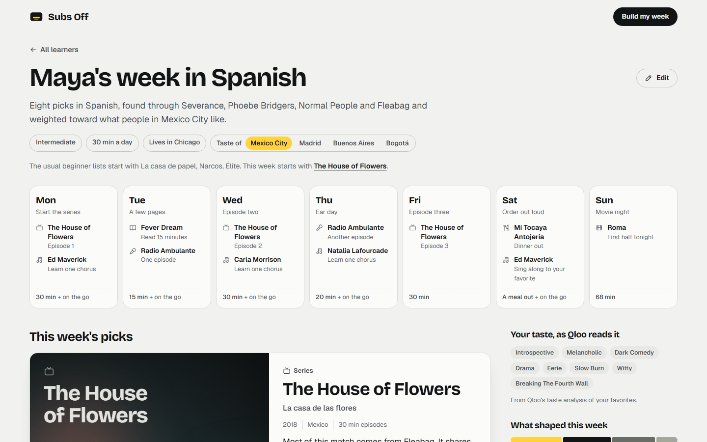
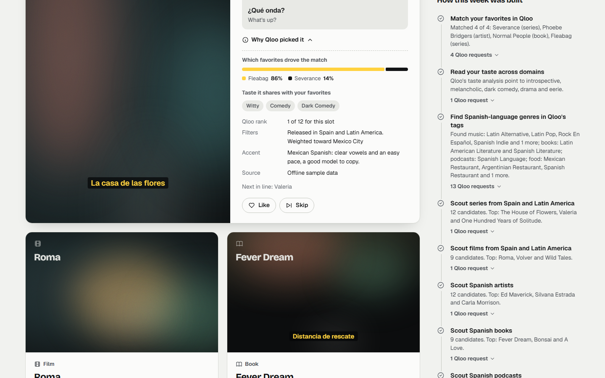

# Subs Off

Your taste, in another language.

**Try it:** https://subs-off.fuddleyu.workers.dev (no sign-up; four sample learners start a full week in one click)

Subs Off plans a week of series, films, music, books, podcasts and one restaurant in the language you're learning, picked from four things you already love. The picks, their ranking and the reasons behind them come from [Qloo](https://www.qloo.com)'s taste graph. A small agent does the asking, checks what comes back, widens the search when results run thin, and re-plans when you like or skip something.



## Why it exists

Everyone learning a language gets the same advice: watch and listen to things in that language. Then they get handed the same five titles. If you love Severance and Phoebe Bridgers, a heist series and a reggaeton playlist won't keep you coming back, and the whole method depends on coming back every day.

Subs Off starts from what you already like and finds the closest things that happen to be in Spanish, French, Japanese, Korean, Portuguese, Italian or German.

## Why Qloo is the core of it

Take Qloo out and there is nothing left to rank. Each part of the plan leans on something only the taste graph has:

- **Cross-domain affinity.** Qloo knows what fans of one thing like in other domains, so a TV favorite can point to a songwriter and a novel to a film, ranked by what those audiences actually like. An LLM can name famous titles; it can't rank a catalog by the overlap between real audiences.
- **Taste of a city.** `signal.location.query` weights every pick toward what people in Mexico City, Madrid, Buenos Aires or Bogotá like. Switching the city on the plan re-ranks the week and says which picks moved and why.
- **Explainability.** With `feature.explainability=true`, Qloo reports which of your favorites drove each match. The "why" on every card and the "What shaped this week" bar come from those scores, so the explanation is evidence, not model prose.
- **Taste analysis and tags.** `filter.type=urn:tag` turns your favorites into a taste profile (introspective, dark comedy, slow burn), and `/v2/tags` finds each language's own genres (Latin Alternative, City Pop, Chanson) so music and books stay in the target language.

## What the agent does

Every step shows up in the app's "How this week was built" panel, with the exact Qloo request behind it (never the key).

| Step | Qloo call | What it sends |
| --- | --- | --- |
| Match your favorites | `GET /search` | the title you typed, its type |
| Read your taste | `GET /v2/insights` | `filter.type=urn:tag`, your favorites as `signal.interests.entities` |
| Find the language's genres | `GET /v2/tags` | `filter.query` such as "latin alternative", scoped to artists, books, podcasts or places |
| Scout series and films | `GET /v2/insights` | `filter.release_country`, `signal.location.query`, `feature.explainability`, favorites and likes as signals, skips excluded |
| Scout artists, books, podcasts | `GET /v2/insights` | `filter.tags` with the language's genres, the city signal, explainability |
| Scout a restaurant | `GET /v2/insights` | `filter.location.query` with your own city, cuisine tags |

Then it curates and schedules without calling anyone:

- **Qloo's order leads.** The agent only reorders close neighbors for your level (beginners get comedies, shorter episodes and learner podcasts; advanced learners get full albums and no subtitles) and for variety across the three artists.
- **It widens instead of failing.** If the city weighting leaves too few results, it drops the location signal and says so. If taste analysis is refused, it builds your profile from your favorites' own tags.
- **Likes and skips change the next round.** A liked pick stays and becomes a signal. A skip is excluded, and the reason matters: "Not for me" pushes down its distinctive tags, "Too hard" shifts that slot toward easier picks, "Seen it" just removes it. The re-plan lists what changed and why.
- **A week you can keep.** The same series runs through the week so the voices get familiar. Long episodes are split into timed sittings that fit your daily minutes. Music and podcasts count as listening on the go.

Each pick also carries an accent note (Argentine *vos*, Spain's *vosotros*, Quebec vowels) and a few phrases to listen for, written by hand for that dialect.



## Where the LLM fits

Llama on Cloudflare Workers AI rewrites the one-line notes in a warmer voice after the plan is ready. It never picks, ranks or adds anything. Its output is checked against the Qloo evidence: a note that doesn't mention a real driver, shared tag or city, or that uses stock marketing phrases, is dropped and the plain template note stays. Without the AI binding (local runs, tests) everything works with templates.

## Run it locally

Needs Node.js 22.12 or newer.

```sh
npm install
npm run dev        # http://127.0.0.1:5436
npm test
```

Without a key the app runs on a small offline catalog that answers in the same JSON shapes as the Qloo API, and it says so in the footer and on every pick. To use the live API:

```sh
cp .dev.vars.example .dev.vars   # then paste your Qloo key into it
npm run qloo:check               # three small live calls that confirm key, base URL and shapes
npm run dev
```

Other scripts:

| Script | What it does |
| --- | --- |
| `npm run record` | Runs the four sample learners (and the like-and-skip re-plan) against the live API and saves trimmed answers to `fixtures/recorded.json`, with a report in `fixtures/record-report.json`. |
| `npm run shots` | Captures every screen at 1440x900 and 390x844 into `qa/` with Playwright's Chromium. |
| `npm run dev:worker` | Runs the real Worker in workerd on port 5437 with offline data. No Cloudflare account needed. |
| `npm run typecheck` | TypeScript checks for the Worker, the front end, scripts and tests. |

## Deploy

Cloudflare Workers with Static Assets and a Workers AI binding. The Qloo key is a Worker secret and never reaches the browser. Exact commands are in [DEPLOY.md](DEPLOY.md).

## How it's built

```
Browser (Preact)
   |  POST /api/plan  (streams agent steps as NDJSON, then the plan)
   v
Cloudflare Worker (Hono)
   |-- agent loop ............ src/agent   match, read taste, find genres, scout, curate, schedule
   |-- Qloo client ........... src/qloo    one interface, four transports:
   |                                         live REST (X-Api-Key, retries, timeouts)
   |                                         recorded answers (fixtures/recorded.json)
   |                                         offline simulator over a sample catalog
   |                                         cache (memory, optional KV)
   '-- Workers AI ............ optional notes, filtered and grounded
```

- `src/qloo/` is the only code that knows Qloo's URLs and JSON. Switching from offline to live is one secret (`QLOO_API_KEY`); `QLOO_MODE` can force either.
- In live mode, answers already recorded for the sample learners are served first, which keeps the demo fast and spares the event quota. When Qloo is briefly unavailable, a recorded answer for the same request is used; simulated data is never mixed into live mode.
- `test/` covers query canonicalization, the live transport (headers, base URL, retries, error mapping), parsing of documented response shapes, the agent loop, re-planning from likes, skips and city changes, the writer's fallbacks, the HTTP API, a full live-mode run against a Qloo-shaped server, and record-then-replay.

## Data handling

Qloo receives only titles, Qloo IDs, tag IDs and city names. A learner's name stays in their browser. There are no accounts, no tracking and no stored profiles; the last week is kept in the browser's local storage for convenience. Qloo results describe aggregate affinities, and the app presents them that way ("people who love X tend to rate this highly"), never as a prediction about a person.

## Known limits

- Language for music, books and podcasts comes from Qloo tags. A tag like Latin Pop can include some songs that aren't in Spanish.
- Release country stands in for language on screen: a Spanish production can be in Catalan, and some co-productions are in English.
- Phrases and accent notes are general and hand-written. They are not quotes from the picks.
- The offline catalog is small and its scores are a rough tag-overlap model. It exists so the app and its tests run without a key.
- The restaurant pick needs your city, and Qloo coverage of places varies by city.

## Credits

Built with TypeScript, Hono, Preact, esbuild, Vitest and Playwright on Cloudflare Workers. Fonts: Bricolage Grotesque and Geist (SIL Open Font License). Icons: Tabler Icons (MIT). Taste data: Qloo.

## License

MIT. See [LICENSE](LICENSE).
